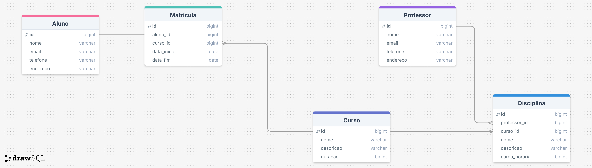

# Softex (BFD) - Back End (Node)

> Obs. Desse commit em diante o sistema vai rodar usando o [Deno](https://deno.com/) para rodar os códigos e projetos

## Projetos Relacionados ao curso

- Projeto do Modulo 1 - [Votação de Cardeais](https://github.com/Sansao77/eleicao_papa)

## 1º Aula (Introdução) [[Atividade relacionada](./atividades-presencial/modulo-1/aula_1.js)]

- Introduções e conhecimentos gerais
- Professor: Silvio Monte (Desenvolvedor Back End e Engenheiro de Redes)
- Instalação do Node
- Estudo sobre lógica de programação e variáveis

## 2º Aula [[Atividade relacionada](./atividades-presencial/modulo-1/aula_2.js)]

1. Explicação sobre variáveis (var, let e const):
    - var: tipo de variável antigo, mutavel e global
    - let: tipo de variável moderno, mutavel e local
    - const: tipo de variável moderno, imutável e local

2. Explicação sobre tipos de dados:
    - String: texto ()
    - Number: número
    - Boolean: vardadeiro ou falso (true or false)
    - Null: nulo (intencionalmente vazio)
    - Undefined: variável sem valor definido ainda

3. Operadores Aritméticos:
    - Soma: +
    - Subtração: -
    - Multiplicação: *
    - Divisão: /
    - Resto da Divisão: %

4. Operadores de Atribuição:
    - Atribui valor: =
    - Soma e atribui: +=
    - Subtrai e atribui: -=
    - Multiplica e atribui: *=
    - Divide e atribui: /=

5. O que é entrada e saida de dados:
    - Entrada de dados: é quando o programa recebe informações do usuário, como um nome, número ou qualquer outro dado
    - Saida de dados: é quando o programa mostra uma informação para o usuáŕio

6. Estruturas de decisão (if, else if, else):
    - Condições se (if ou else if) para definir se tal informação é de certa lógica
    - Se não (else) para quando não for dentro da categória definida

7. Operadores de comparação
    - Igual: ==
    - Diferente: !=
    - Maior: >
    - Menor: <
    - Maior ou igual: >=
    - Menor ou igual: <=
    - Igual e do mesmo tipo: ===
    - Diferente tipo/valor: !==

8. Operadores lógicos
    - E (AND): && (Ambos devem ser verdadeiros para ser verdade)
    - OU (OR): || (Pelo menos um deve ser verdadeiro para ser verdade)
    - NÃO (NOT): ! (Inverte o valor verdade para falso e vice-versa)

## 3º Aula [[Atividade relacionada](./atividades-presencial/modulo-1/aula_3.js)]

1. Estruturas de Repetição
    - for: faça uma ação repetidamente dentro de um número de vezes determinado
    - while: faça uma ação repetidamente dentro de um número de vezes indeterminado, avalie a condição antes de fazer a ação
    - do-while: faça uma ação repetidamente dentro de um número de vezes determinado, faça a ação antes de avaliar a condição

2. Arrays (Vetores) e Operações Básicas
    - array/vetor é uma estrutura que serve para armazenar vários valores em uma unica variável
    - Operações de arrays:
        a. push - Adiciona um elemento no final do array
        b. pop - Removee o ultimo elemento listado no array
        c. length - Retorna o tamanho do array (quantos elementos ele tem)

## 4º Aula [[Atividade relacionada](./atividades-presencial/modulo-1/aula_4.js)]

- Apresentações sobre modelos ageis
- Revisão das atividades e assuntos concluidos

## 5º Aula [[Atividade relacionada](./atividades-presencial/modulo-1/aula_5.js)]

- Estudo sobre Vetores
    - variáveis que tem mais de um dado armazenado

- Processo e Fases do Desenvolvimento de Software

## 6º Aula [[Atividade relacionada](./atividades-presencial/modulo-1/aula_6.js)]

- Funções
    - Blocos de código que realizam tarefas específicas e que podem ser reutilizadas

## 7º Aula [[Atividade relacionada](./atividades-presencial/modulo-1/aula_7.js)]

- Apresentação sobre Requisitos funcionais e não funcionais, desenvolvimento de um projeto e entrega ao cliente
- Estudo sobre Git e Github

## 8º Aula [[Atividade relacionada](./atividades-presencial/modulo-2/aula_8.ts)]

- Estudo sobre POO (Programação Orientada a Objetos)
    - Encapsulamento
    - Abstração
    - Polimorfismo

- Introdução a TypeScript

## 9º Aula [[Atividade relacionada](./atividades-presencial/modulo-2/aula_9.ts)]

- Estudo sobre atributos, metodos e interação entre objetos
    - Atributos: variáveis da classe
    - Metodos: funções da classe
    - Interação entre classes: é possível uma classe herdar os atributos e metodos de outra

## 10º Aula [[Atividade relacionada](./atividades-presencial/modulo-2/aula_10.ts)]

1. Sintaxe da linguagem OO (Orientação de Objetos) em TypeScript
    - Modificadores de Acesso/Visibilidade
        - public (padrão/default): acessível em qualquer lugar
        - protected: acessível dentro da classe e de suas subclasses
        - private: acessível apenas dentro da propria classe;

    - Parâmetros Opcionais
        - readonly: valor só pode ser definido no constructor, depois não muda
        - ? : Torna um atributo opcional

2. Abstração: Definição e Uso de Classes Abstratas
    - Em POO, significa criar um modelo genérico para entidades relacionadas
    - Implementação concreta fica nas subclasses

3. Estudo de Engenharia de Software - Analise Orientada a Objetos e UML

## 11º Aula [[Atividade relacionada](./atividades-presencial/modulo-2/aula_11.ts)]

- Estudo sobre Interface
- Apresentação sobre UML

## 12º Aula [[Atividade relacionada](./atividades-presencial/modulo-2/aula_12.ts)]

- Estudo sobre encapsulamento de atributos
    - Uso de Gets e Sets

## 13º Aula [[Atividade relacionada](./atividades-presencial/modulo-2/aula_13.ts)]

- Estudo sobre erros e throws

## 14º Aula [[Atividade relacionada](./atividades-presencial/modulo-2/aula_14.ts)]

- Estudo sobre modelagem de projetos e classes utilizando UML (Unified Modeling Language)

## 15º Aula

- Testes de Software para Backend com TypeScript
  - Definições

      1. Teste de Software: Processo de executar um programa com a intenção de encontrar erros e verificar se ele atende aos requisitos específicados
      2. Teste Unitário

          - Testa uma unidade mínima do código (Ex: uma função ou metodo)
          - Garante que um metodo isolado funciona como esperado
          - Exemplo: verificar se adicionarEstoque() realmente aumenta a quantidade

      3. Teste de Integração

          - Testa a comunicação entre diferentes partes do sistema
          - Exemplo: verificar se ao registrar uma Entrada o estoque total do Produto é atualizado corretamente

      4. Teste Automatizado

          - Teste escrito em código, executando automaticamente sempre que necessário
          - Vantagem: pode ser repetido várias vezes, sem depender de execução manual

      5. Frameworks de Testes

          - Ferramenta que auxilia a escrever e executar testes
          - No Typescript/Javascript, os mais usados são: [Jest](https://jestjs.io/) , [Mocha](https://mochajs.org/next/) , [Chai](https://www.chaijs.com/)

  - Boas práticas em testes

      - Testar pequenas partes isoladas primeiro (unidade)
      - Cobrir cenários normais e de erro (casos extremos)
      - Automatizar sempre que possível
      - Nomear testes de forma clara: um bom nome já explica o que está sendo testado
      - Aplicar o princípio AAA
          - Arange: preparar os dados do teste
          - Act: Executar a ação
          - Assert: Verificar o resultado

## 16º Aula

- Introdução a Dados, Informação e Modelagem de Banco de Dados

  1. Dado, informação e banco de dados:

    - Dado: é uma entidade que possui características e comportamentos
    - Informação: é o conhecimento sobre um dado, obtido através de processamento ou análise
    - Banco de Dados: é uma coleção organizada de dados, armazenados e gerenciados por um sistema de gerenciamento de banco de dados

  2. O que é um SGBD (Sistema de Gerenciamento de Banco de Dados)

    - É um software que permite criar, gerenciar e manipular bancos de dados relacionais ou não relacionais
    - Exemplos: MySQL, PostgreSQL, MongoDB, Firebase, etc.

  3. Explique a diferença entre modelo conceitual, lógico e físico

    - Modelo Conceitual: é uma representação abstrata dos dados, sem se preocupar com detalhes técnicos
    - Modelo Lógico: é uma representação mais detalhada dos dados, considerando as restrições e integridade
    - Modelo Físico: é a implementação física dos dados, considerando os recursos disponíveis e as necessidades de desempenho

  4. Construa um DER simples para um **sistema de vendas** (Cliente, Produto, Pedido)

    - Propriedades:
     - Cliente: id, nome, email, telefone, endereço
     - Produto: id, nome, descrição, preço, estoque
     - Pedido: id, cliente_id, produto_id, quantidade, data, status

    - Relacionamentos:
      - Cliente faz Pedido
      - Pedido envolve Produto

    - Cardinalidades
      - Cliente: 1:N com Pedido (Um cliente pode fazer N pedidos)
      - Produto: 1:N com Pedido (Um produto pode estar em N pedidos)
      - Pedido: 1:1 com Cliente e Produto (Um pedido é feito por um cliente e contém um produto)

  5. Transforme esse DER em tabelas relacionais (modelo lógico):

    | Tabela | Colunas |
    |--------|---------|
    | Cliente | id, nome, email, telefone, endereço |
    | Produto | id, nome, descrição, preço, estoque |
    | Pedido | id, cliente_id, produto_id, quantidade, data, status |

- Entidades, Atributos e Relacionamentos

  1. Tipos de Entidades

    - Entidade Forte: é uma entidade que possui uma identidade única e persistente, como Cliente, Produto e Pedido
    - Entidade Fraca: é uma entidade que não possui uma identidade única e persistente, como Endereço, Telefone e Email
    - Entidade Associativa: é uma entidade que não possui uma identidade única e persistente, mas é necessária para estabelecer uma relação entre duas entidades fortes, como Pedido e Cliente.

  2. Tipos de Atributos

    - Atributo Primário: é um atributo que identifica de forma única uma entidade, como id em Cliente, Produto e Pedido
    - Atributo Secundário: é um atributo que não identifica de forma única uma entidade, como nome em Cliente, Produto e Pedido
    - Atributo Composto: é um atributo que é composto por outros atributos, como email em Cliente
    - Atributo Multivalorado: é um atributo que pode ter vários valores, como telefones em Cliente
    - Atributo Opcional: é um atributo que pode ou não existir, como endereço em Cliente
    - Identificador (ou chave): é um atributo que identifica de forma única uma entidade, como id em Cliente, Produto e Pedido

    Obs. Nem todo atributo é obrigatório, alguns podem ser opcionais.

  3. Tipos de Relacionamentos

    > Relacionamentos é a forma como entidades se relacionam entre si.

    - Relacionamento Binário: é uma relação entre duas entidades fortes, como Cliente e Produto
    - Relacionamento Ternário: é uma relação entre três entidades fortes, como Pedido, Cliente e Produto
    - Relacionamento Recursivo: é uma relação entre uma entidade forte e ela mesma, como Categoria e Subcategoria
    - Relacionamento Generalização/Especialização: é uma relação entre uma entidade forte e outra entidade forte, onde a primeira é uma generalização da segunda, como Produto e ProdutoEletronico

  4. Tipos de Cardinalidade

    > Cardinalidade é a quantidade máxima de entidades relacionadas a uma entidade.

    - 1:1 (Um para Um) ---> Ex: Pessoa (1) ------ (1) Endereço
    - 1:N (Um para Muitos) ---> Ex: Cliente (1) ------ (N) Pedidos
    - N:N (Muitos para Muitos) ---> Ex: Aluno (N) ------ (N) Disciplina

  5. Exemplo de DER (Diagrama de Entidade-Relacionamento) + SQL na (atividade 2 da aula 16)[./atividades-presencial/modulo-3/aula_16_2.sql]

    
